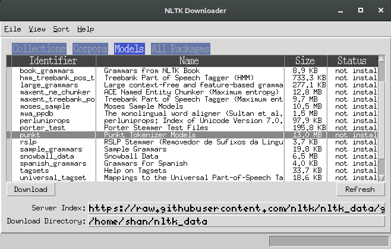

# Autoranking Amazon Reviews

Prediction of real valued helpfulness scores for Amazon product reviews based on various categories of features of the review text, and other metadata associated with the review, with the purpose of generating a rank for a given list of reviews.  
The problem was modeled with the purpose of ranking them, as a regression problem. The performance was evaluated by using the the coefficient of determination and rank correlation.

## Installation of Required Packages

#### For python3
+ Create a virtual environment  
`virtualenv venv`
+ Activate the virtualenv with  
`source venv/bin/activate`
+ Go into the project directory and install the required dependencies.  
`pip install -r requirements.txt`

#### For Anaconda
+ Download the Anaconda installer from [Anaconda linux downloads page](https://www.anaconda.com/download/#linux)
+ Open the terminal in the directory containing the downloaded file and type  
`bash <anaconda filename>`
+ Select yes when it asks for adding anaconda to the path variable.
+ Now install textblob with the command  
`conda install -c conda-forge textblob`

#### Setting up textblob
+ Open the python3 shell in terminal and type
```python
import nltk
nltk.download()
```
+ A window will pop up. Go to the models tab and install the package **punkt**.  


## Dataset

+ The dataset is a 5-core json file which can be can be downloaded from .
+ The model was trained on the reviews for *Video Games* products category on Amazon but it will work for any other product category as well.
+ For categories other than *Video Games*, the feature selection and choosing the number of words for creation of bag of words matrix has to be tuned because the number of available reviews for each product category is different.
